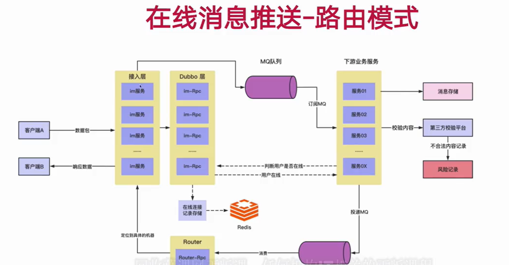
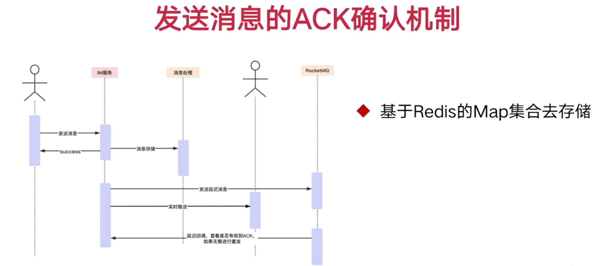
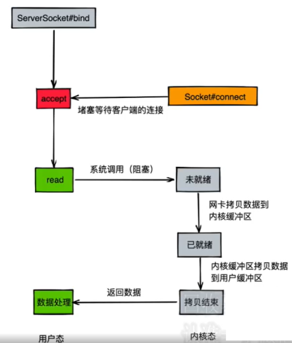
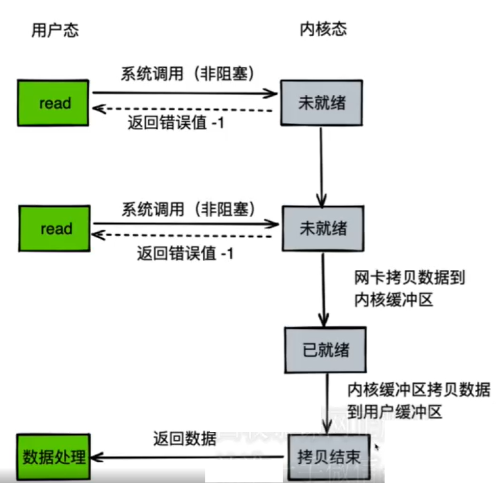
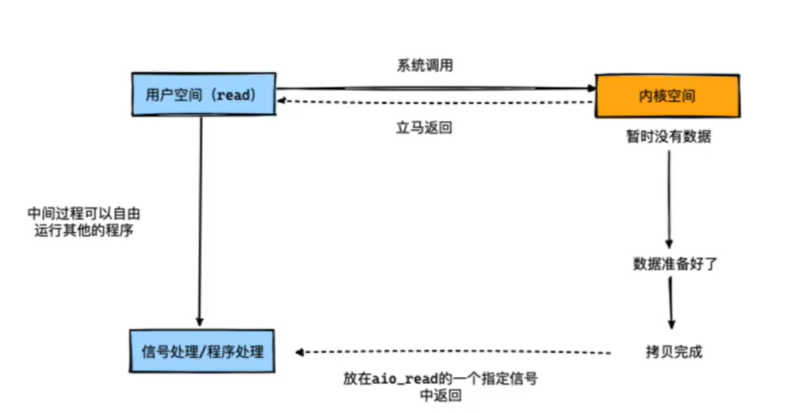

## 直播带货购物平台

这是一个微服务架构的直播带货购物平台

**项目特点：**

* 使用读写分离技术，提高性能
* 实现IM通讯系统，在线聊天室
* 直播间红包雨抢红包功能
* 直播带货秒杀功能\
**······**

### 技术栈

* 微服务注册中心：Nacos
* 网关： Spring Cloud Gateway
* Rpc远程调用： Dubbo
* 配置中心： Nacos
* 缓存： Redis
* 数据库： MySQL
* 消息队列： Kafka
* 分库工具： Sharding-Jdbc
* IM搭建： Netty
* 数据库版本管理： flyway

Spring Cloud Alibaba 版本： 2022.0.0.0-RC1 \
Spring Boot 版本： 3.0.4 \
JDK 版本： 17 

### 项目结构
* cloud-live-api : Rpc远程调用暴露接口
* cloud-live-common : 公共模块(包括公共配置、公共工具类、DTO/VO实体类、公用PO实体类、枚举类等)
* cloud-live-gateway : 网关
* cloud-live-im : IM通讯服务器模块
* cloud-live-living : 直播模块
* cloud-live-msg : IM消息处理中台
* cloud-live-pay : 支付中台
* cloud-live-router : IM消息路由模块
* cloud-live-shop : 购物模块
* cloud-live-user : 用户中台

### 部分场景分析

#### 是否需要引入本地缓存
> 本地缓存的缺陷：如果热数据很多的话，不建议使用本地缓存，因为本地缓存空间有限，热数据频繁变更会导致本地缓存不断触发缓存淘汰

#### 远程调用选择

HTTP和RPC的区别：
1. 传输协议
   1. RPC可以基于HTTP协议也可以基于TCP协议

2. 传输效率：
   1. RPC使用自定义的TCP协议，可以让请求报文体积更小，或者使用HTTP2协议，也可以很好的减小报文体积 
   2. HTTP如果是基于1.1的版本，那就会包含很多无用的内容

3. 性能消耗
   1. RPC可以实现高效的二进制传输
   2. HTTP大部分是基于json实现的序列化比较耗时

4. 负载均衡
   1. RPC基本自带了负载均衡策略
   2. HTTP需要配置Nginx这种

5. 服务治理
   1. 下游服务新增，重启，下线时如何不影响上游调用者
   2. RPC能做到自动通知，不影响上游
   3. HTTP需要事先通知，如修改NGINX配置

因此本项目使用Dubbo作为RPC框架

**RPC项目结构：** \
cloud-live-api:该模块定义好远程调用接口，该模块作为共用模块供需要使用远程调用的模块引入\
其他具体模块引入该模块使用，或者引入该模块对远程调用进行实现\

### 重要功能介绍

#### 数据库读写分离实现

##### 1 基于Docker搭建MySQL主从数据库集群

**主数据库配置文件**
```cassandraql
[mysqld]
datadir = ./data
character-set-server = utf8
lower-case-table-names = 1
# 主从复制-主机配置# 主服务器唯一 ID
server-id = 1
# 启用二进制日志
log-bin=mysql-bin
# 设置 logbin 格式
binlog_format = STATEMENT
```
**从数据库配置文件**
```cassandraql
[mysqld]
datadir = ./data
character-set-server = utf8
lower-case-table-names = 1
# 主从复制-从机配置# 从服务器唯一 ID
server-id = 2
# 启用中继日志
relay-log = mysql-relay
```
docker启动mysql8.0

主数据库执行
```shell
- 主数据库创建用户 slave 并授权
# 创建用户,设置主从同步的账户名
create user 'live-slave'@'%' identified with mysql_native_password by 'live-mall';
# 授权
grant replication slave on *.* to 'live-slave'@'%';
# 刷新权限
flush privileges;
# 查询 server_id 值
show variables like 'server_id';
# 也可临时（重启后失效）指定 server_id 的值（主从数据库的 server_id 不能
相同）
set global server_id = 1;
# 查询 Master 状态，并记录 File 和 Position 的值，这两个值用于和下边的从数
据库中的 change 那条 sql 中
的 master_log_file，master_log_pos 参数对齐使用
show master status;
show binlog events;
# 重置下 master 的 binlog 位点
reset master;
```

从数据库执行
```shell
# 进入从数据库
# 注意：执行完此步骤后退出主数据库，防止再次操作导致 File 和 Position 的值发生变化
# 验证 slave 用户是否可用
# 查询 server_id 值
show variables like 'server_id';
# 也可临时（重启后失效）指定 server_id 的值（主从数据库的 server_id 不能
相同）
set global server_id = 2;
# 若之前设置过同步，请先重置
stop slave;
reset slave;
# 设置主数据库
change master to master_host='ip地址',master_port=port,master_user='live-slave',
master_password='live-mall',master_log_file='binlog.000001',master_log_pos=157;
# 开始同步
start slave;
# 若出现错误，则停止同步，重置后再次启动
stop slave;
reset slave;
start slave;
# 查询 Slave 状态
show slave status;
```
查看参数 Slave_IO_Running 和 Slave_SQL_Running 是否都为yes，则证明配置成功。若为 no，则需要查看对应的 Last_IO_Error 或 Last_SQL_Error 的异常值，并百度解决。

##### 2 项目配置文件配置多数据源
```yaml
spring:
    datasource:
        dynamic:
            primary: write_db
            strict: false
            datasource:
                write_db:
                    driver-class-name: com.mysql.cj.jdbc.Driver
                    url: jdbc:mysql://IP:port/${live.dbname}?serverTimezone=Asia/Shanghai&useUnicode=true&characterEncoding=utf-8&allowMultiQueries=true
                    username: dbname
                    password: dbpassword
                read_db:
                    driver-class-name: com.mysql.cj.jdbc.Driver
                    url: jdbc:mysql://IP:port/${live.dbname}?serverTimezone=Asia/Shanghai&useUnicode=true&characterEncoding=utf-8&allowMultiQueries=true
                    username: dbname
                    password: dbpassword
```

在代码的事务层中对应读数据库的地方使用注解`@DS("read_db")`,不使用注解的地方默认使用写数据库

#### 数据一致性解决方案（先更新数据库再删缓存）
##### 方案一，延迟双删
1. 线程1删除缓存，然后去更新数据库
2. 线程2来读缓存，发现缓存已经被删除，所以直接从数据库中读取，这时候由于线程1还没有更新完成，所以读到的是旧值，然后把旧值写入缓存
3. 线程1，根据估算的时间，可以设置1s的sleep，由于sleep的时间大于线程2读数据+写缓存的时间，所以缓存被再次删除
4. 如果还有其他线程来读取缓存的话，就会再次从数据库中读取到最新值

在本项目中借助了kafka消息队列中的延迟队列实现延迟双删，例如在用户缓存场景下
```java
@Component
@Slf4j
public class UserDelayDeleteConsumer {
    @Resource
    private RedisTemplate<String, String> redisTemplate;

    @Resource
    private UserProviderCacheKeyBuilder userProviderCacheKeyBuilder;

    private static final DelayQueue<DelayedTask> DELAY_QUEUE = new DelayQueue<>();

    private static final ExecutorService DELAY_QUEUE_THREAD_POOL = new ThreadPoolExecutor(
            3, 10,
            10L, TimeUnit.SECONDS,
            new ArrayBlockingQueue<>(100)
    );

    @PostConstruct()
    private void init() {
        DELAY_QUEUE_THREAD_POOL.submit(() -> {
            while (true) {
                try {
                    DelayedTask task = DELAY_QUEUE.take();
                    task.execute();
                    log.info("DelayQueue延迟双删了一个用户缓存");
                } catch (InterruptedException e) {
                    log.error(e.getMessage());
                    e.printStackTrace();
                }
            }
        }, "Thread-user-delay-delete-cache");
    }

    @KafkaListener(topics = "user-delete-cache")
    public void consumerTopic(String kafkaObjectJSON) {
        KafkaObject kafkaObject = JSONUtil.toBean(kafkaObjectJSON, KafkaObject.class);
        String code = kafkaObject.getCode();
        log.info("Kafka接收到的json：{}", kafkaObjectJSON);
        long userId = Long.parseLong(kafkaObject.getUserId());
        if(code.equals(KafkaCodeEnum.USER_INFO.getCode())) {
            DELAY_QUEUE.offer(new DelayedTask(1000,
                    () -> redisTemplate.delete(userProviderCacheKeyBuilder.buildUserInfoKey(userId))));
            log.info("Kafka接收延迟双删消息成功，类别：UserInfo，用户ID：{}", userId);
        }else if (code.equals(KafkaCodeEnum.USER_TAG_INFO.getCode())){
            DELAY_QUEUE.offer(new DelayedTask(1000,
                    () -> redisTemplate.delete(userProviderCacheKeyBuilder.buildTagInfoKey(userId))));
            log.info("Kafka接收延迟双删消息成功，类别：UserTagInfo，用户ID：{}", userId);
        }
    }

}
```

##### 方案二，使用canal实现延迟双删
> canal是一款binlog的解析工具，可以通过tcp协议将数据同步到client端，但不能根据canal直接把数据库同步到redis


#### IM通讯系统
> IM通讯系统一般有两种类型，拉模型和推模型，拉模型一般用于聊天，推模型一般用于直播

##### 路由模式
使用路由模式实现IM通讯，广播消息会发送给所有的IM服务，但是我们某个用户肯定某次只想与其通信的另一个客户端之间的IM服务器通信

模块`cloud-live-im`是用于与客户端建立连接以及接收/发送消息的模块，该模块不会对消息进行处理\
模块`cloud-live-msg`是用于消息处理的模块，在实际的应用场景中，比如直播间的聊天室内，我们可能需要对一些违禁词进行处理或者对消息进行存储等操作\
模块`cloud-live-router`是用于路由消息的模块，该模块会根据消息的来源和目标客户端，将消息路由到对应的IM服务上，因为客户端连接都是通过IM模块进行的，当该服务进行分布式集群部署时，可能不同的客户端连接的服务不同，所以需要通过该模块对消息的目标用户进行路由定位到指定的IM服务\


##### 心跳检测
> 主要用于判断用户是否在线，使用redis来保存心跳时间，每隔一段时间检测一次，如果超过一定时间没有检测到心跳，则认为用户离线

##### 消息接收成功的ACK确认机制
> 主要保证消息的可靠性，模仿TCP的ACk机制


使用Redis Map存储发送过的消息，若我们成功接收到了ACK，我们就将RedisMap中移除对应的消息，若没有收到ACK，那么在一定延迟后，我们再次去发送消息

##### IO模型

BIO\


NIO\


AIO\


Netty为何使用NIO实现而不是使用AIO
1. 不比nio快在Unix系统上
2. 不支持数据报
3. 不必要的线程模型（太多没什么用的抽象化）


#### 开播与直播列表功能实现 （读多写少场景）

因为主播的人数是远远小于观众人数的，所以针对开播和关播，查询直播列表这个场景下，该项目通过redis缓存开播列表，并定时刷新缓存

1. 针对主播开播操作，直接将该主播的开播直播间信息加入到redis内的首位
2. 通过定时任务的方式刷新缓存，优化刷新缓存的策略，并不是每次任务启动都对直播列表进行刷新，而是在redis内再添加一个刷新标记，当需要刷新缓存时，将该标记进行配置，定时任务定时检测该标记，检测到需要刷新再从数据库读取最新数据，这样可以合理的控制刷新频率，并且数据的一致性也不差
3. 针对主播进行关闭直播间的操作，因为该操作不像开播操作一样，因为开播可以保证当前添加到直播间列表的肯定是最晚开播的，所以直接添加到头即可，或者任意添加通过前端排序即可，但是关播操作需要定位到再redis中对应的直播数据，这个操作本身O(n)的复杂度，一旦系统数据量上来关播就变得比较耗时，并且考虑到对于开播来说观众更不关心关播一致性要求没开播那么高，所以这个地方直接配置刷新操作的标记，等定时任务刷新即可。

#### 直播订阅功能
> 观众通过订阅主播的直播，当主播开播时发送消息给订阅了的观众

优化的点其实就是需要进行批量的消息发送即可，将数据库中订阅的用户都读取出来，然后通过消息路由模块批量发送消息即可

#### 直播送礼并发优化
> 因为直播间可能会存在一些廉价的礼物导致频繁的发送，所以这部分需要考虑高并发的场景下的优化问题

该项目通过使用本地缓存的方式来降低远程调用的损耗（因为送礼功能需要涉及到支付中台模块涉及到远程调用）

#### 抢红包功能

##### 红包数据存储位置设计
1. 使用redis存储红包数据->pop接口领取红包（单个List存储1k个红包）（redis的分片存储，100个list） 缺点：每个List存储的数据量不能太大，否则有大key风险，但是可以利用 分片思路进行存储
2. 本地内存存储红包数据->（500台tomcat，每台tomcat的本地内存里存储一定量的红包数据。20000个红包，一共是1000w个红包，2亿元红包，1kw人瓜分）（结合dns访问所在地最近的一台clb，clb-> nginx集群 ->gateway -> tomcat） 缺点：500台tomcat，假设其中的某一台挂了，导致这台tomcat的红包没被领完，但是对于平台来说并不亏

##### 红包领取过程

##### 红包生成过程

##### 保证生成的均匀性

#### 直播带货秒杀功能

在直播带货场景中，用户可能会在带货过程中出现抢购情况。例如10000个在线观看直播的用户，于同一时刻参与到抢购行为当中。而在我们的商品下单流程中，库存是一个非常重要的因素。

通常来说，我们建议在以下几个步骤进行库存交验：

1. 加入购物车的时候（真正有购买行为的产生）
2. 生成待订单的时候（库存校验，时间间隔比较大，这批货物是可以购买的

一般来说，大多数情况都是选择在生成待支付订单的时候才会预先扣减库存。而简单的加入购物车其实用户并没有算做是真实购买行为，所以只需要交验基本库存即可

- Mysql 2core 4gb的机器，写流量，抗500+tps，读1000+qps（极限）（支撑的并发度不高，成本很高）
- Redis缓存数据库（读1w+ qps，机器配置高，5w+ qps，redis cluster ）
- 顺序写数据库，写日志类型的方案（redo log）


**基于Redis + MySQL + MQ的方案**

抢购活动组成：活动开始前宣传(主播在准备参与抢购活动之前，需要先点击预热按钮) -> 抢购 -> 抢购结束

将库存的数目存在于redis中，依靠decr指令去扣减库存。

- 被动同步：定时同步，定时任务，每隔一段时间，将我们的库存同步到db中
- 主动同步：每次访问redis之后，异步线程刷新同步到db中，对db的压力会比较大

同时需要依靠一个定时任务，定时将redis中的库存数目同步到mysql表中。但是这里需要注意以下几点：

Redis是内存数据库，内存占用到一定阈值的时候，可能会回收部分数据。不一定要等到ttl清零才回收Redis，有些回收策略，会对ttl进行判断单独拉一台Redis也是可以的，
库存存入Redis后的有效期要足够长，避免说这份缓存数据在抢购活动还没结束前被回收了。（甚至可以考虑单独拉一台redis，然后不设置过期时间，等带货高峰期过后，全部清空）

库存扣减前需要先校验是否充足，然后再记录扣减库存流水，最后才执行库存扣减（这里有多元操作，可以考虑使用Lua脚本）（流水id 临时记录在redis的string中，重复请求）
最后库存扣减成功后，需要发送RMQ去告知下游系统，例如执行支付倒计时，系统通知，购物车清空等操作
支付成功，利用支付中台（qiyu-live-bank）的RMQ通知下游系统，订单状态修改，商品发货（物流系统打交道），系统通知等操作

**库存回滚问题**

如果购物车下单后，一直处于待支付状态，那么就会导致我们的库存一直被锁住了，所以通常来说，这里会做一层回滚的策略。

**定时任务回滚**

需要将处于待支付状态的信息记录到一张表中，表中需要记录订单的生成时间，然后由一个定时任务每隔15秒扫描一次，进行校验，如果订单超时则修改其状态，回滚对应的库存。

**基于延时消息**

RMQ本身基于时间轮做了一套延时队列，我们可以利用该特效去实现，下单30min后消息反向通知的功能。

#### Docker部署